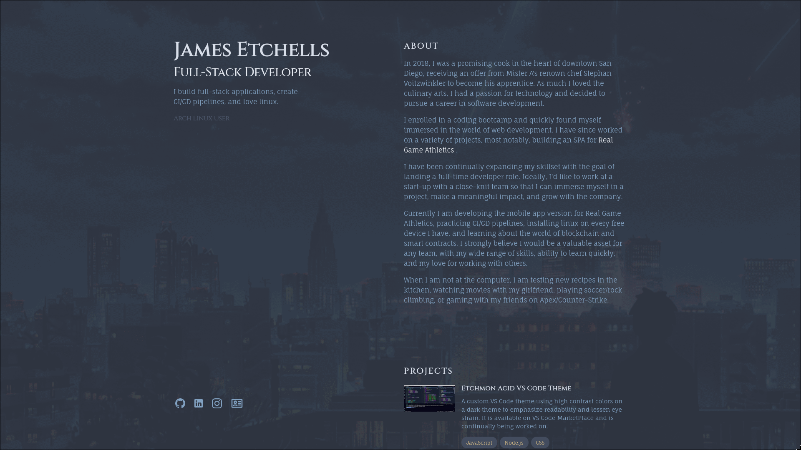

<!-- Badges -->
<h2> James Etchells - Portfolio Website</h2>

  
  <a href="https://github.com/Etchmon/awesome-readme-template/issues/">
    
  <a>
  

   
<h4>
    <a href="https://jamesetchells.com">View Website</a>
</h4>

 
<!-- Screenshots -->
### :camera: Screenshots

 
  

 
<!-- Table of Contents -->
# :notebook_with_decorative_cover: Table of Contents

- [About the Project](#star2-about-the-project)
  * [Screenshots](#camera-screenshots)
  * [Tech Stack](#space_invader-tech-stack)
  * [Features](#dart-features)
  * [Color Reference](#art-color-reference)  
- [Getting Started](#toolbox-getting-started)
  * [Prerequisites](#bangbang-prerequisites)
  * [Installation](#gear-installation)
  * [Running Tests](#test_tube-running-tests)
  * [Run Locally](#running-run-locally)
  * [Deployment](#triangular_flag_on_post-deployment)
- [FAQ](#grey_question-faq)
- [License](#warning-license)
- [Contact](#handshake-contact)
- [Acknowledgements](#gem-acknowledgements)

  

<!-- About the Project -->
## :star2: About the Project
My personal portfolio website that showcases my projects, skills and experience.

<!-- TechStack -->
### :space_invader: Tech Stack
Buit with the following technologies:
- React
- Next.js
- TailwindCSS
- TypeScript
- Cloudflare Pages
- GitHub Actions
- Jenkins

  
Client

  <ul>
    <li><a href="https://www.typescriptlang.org/">Typescript</a></li>
    <li><a href="https://nextjs.org/">Next.js</a></li>
    <li><a href="https://reactjs.org/">React.js</a></li>
    <li><a href="https://tailwindcss.com/">TailwindCSS</a></li>
  </ul>

DevOps

  <ul>
    <li><a href="https://www.github.com/">GitHub Actions</a></li>
    <li><a href="https://www.jenkins.io/">Jenkins</a></li>
  </ul>

<!-- Features -->
### :dart: Features

- Splash animation
- Backgroud animation
- Responsive design

<!-- Contact -->
## :handshake: Contact

James Etchells - etch@jamesetchells.com

Project Link: [https://github.com/Etchmon/jamesetchells](https://github.com/Etchmon/jamesetchells)

<!-- Roadmap -->
## :compass: Roadmap

* [ ] Add Picture to main page
* [ ] Refactor components into layout and ui folders
* [ ] Add tests to check if links and images load correctly

<!-- Acknowledgments -->
## :gem: Acknowledgements

 - [Shields.io](https://shields.io/)
 - [Catppuccin](https://github.com/catppuccin)

